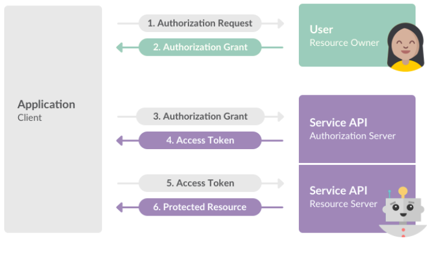
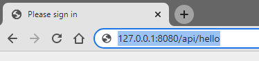
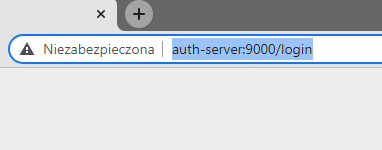
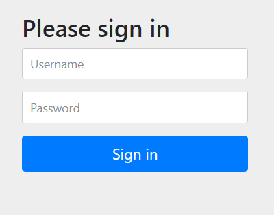
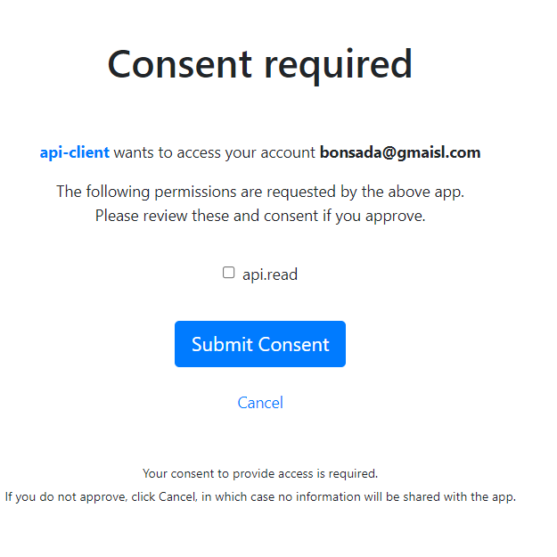
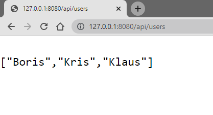

## OAuth2.0 Work Flow Overwiev:
### *Poniższy obrazek obrazuje w ogólnym skrócie ukazuje działanie OAutha2.0*

## Projekt składa się z 3 aplikacji modułowych takich jak:
- **spring-security-client**  port: **8080**
- **OAuth Resource-Server**   port: **8090**
- **OAuth Authorization-Server** port **9000**

### *OAuth2.0 flow with Open ID Conncet*

### *1.First step: 127.0.0.1/api/hello*
<!--    -->

### *2.Next we are redirect to below URI by authorization server.*
<!--  -->

### *3. We must autheciate our acc, by pass credntials*

<!--  -->

### *4. Next we must check  scope, i wyrazić consenst*

<!--  -->

### *5. After That all we got our resorces*

<!--  -->

